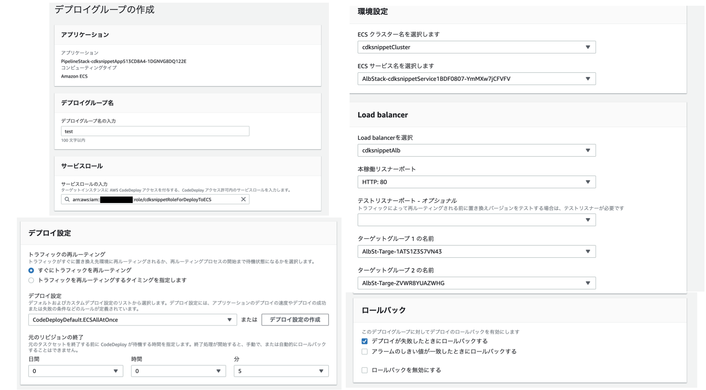
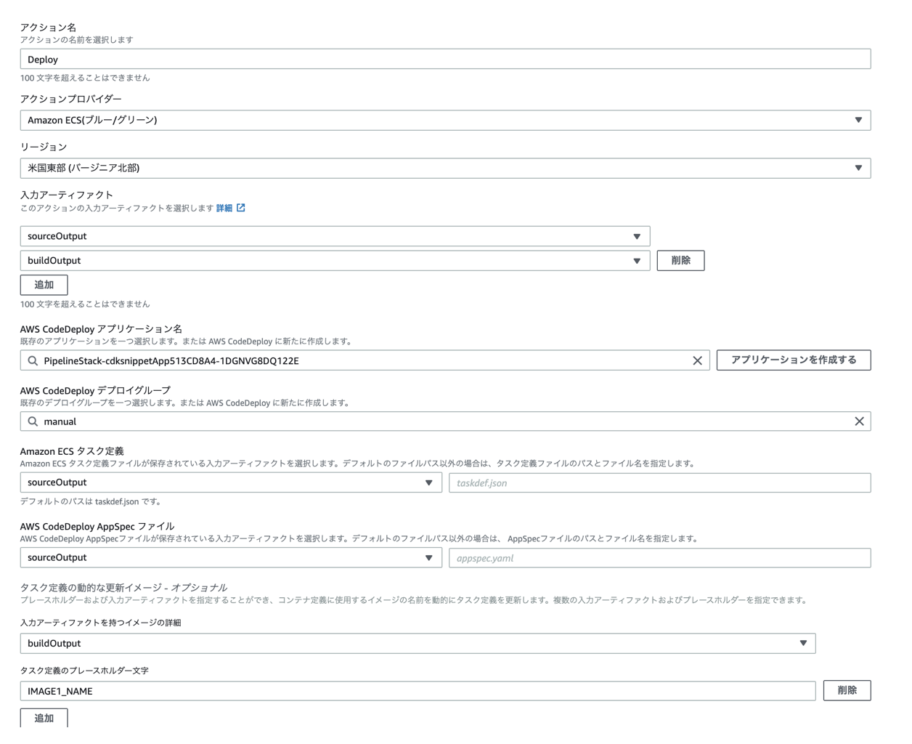

# AWS CDK Snippets

* `npm run build`   compile typescript to js
* `npm run watch`   watch for changes and compile
* `npm run test`    perform the jest unit tests
* `cdk deploy`      deploy this stack to your default AWS account/region
* `cdk destroy`     destroy this stack to your default AWS account/region
* `cdk diff`        compare deployed stack with current state
* `cdk synth`       emits the synthesized CloudFormation template

# API Gateway - Lambda

## APIGW - Lambda Only
---
verified : v2.2.0

### How to deploy

```ts:bin/aws-cdk-snippets.ts
#!/usr/bin/env node
import 'source-map-support/register';
import * as cdk from 'aws-cdk-lib';
import { ApiLambdaStack } from '../lib/ApiLAmbda/api-lambda-stack';

const app = new cdk.App();
new ApiLambdaStack(app, 'ApiLambdaStack');
```

```
$ cdk deploy
```

## APIGW - Lambda with API Key
---
verified : v2.2.0

### How to deploy

```ts:bin/aws-cdk-snippets.ts
#!/usr/bin/env node
import 'source-map-support/register';
import * as cdk from 'aws-cdk-lib';
import { ApiLambdaWithKeyStack } from '../lib/ApiLambdaWithKey/api-lambda-with-key-stack';

const app = new cdk.App();
new ApiLambdaWithKeyStack(app, 'ApiLambdaWithKeyStack');
```

```
$ cdk deploy
```

## APIGW - Lambda with Basic Authorizer Lambda
---
verified : v2.1.0

### How to deploy

```ts:bin/aws-cdk-snippets.ts
#!/usr/bin/env node
import 'source-map-support/register';
import * as cdk from 'aws-cdk-lib';
import { ApiLambdaWithBasicAuthStack } from '../lib/ApiLambdaWithBasicAuthStack/api-lambda-with-basic-auth-stack';

const app = new cdk.App();
new ApiLambdaWithBasicAuthStack(app, 'ApiLambdaWithBasicAuthStack');
```

```
$ cdk deploy
```

## APIGW - Lambda with Cognito Authorizer
---
verified : v2.1.0

### How to deploy

```ts:bin/aws-cdk-snippets.ts
#!/usr/bin/env node
import 'source-map-support/register';
import * as cdk from 'aws-cdk-lib';
import { ApiLambdaWithCognitoStack } from '../lib/ApiLambdaWithCognitoStack/api-lambda-with-cognito-stack';

const app = new cdk.App();
new ApiLambdaWithCognitoStack(app, 'ApiLambdaWithCognitoStack');
```

```
$ cdk deploy
```

### verify

for test this stacks, you have to create user to call API with idToken.

```sh
# create new user (status FORCE_CHANGE_PASSWORD)
$ aws cognito-idp admin-create-user --user-pool-id <USER_POOL_ID> --username <USER_NAME> --user-attributes Name=email,Value=<E_MAIL_ADDRESS> Name=email_verified,Value=true --temporary-password <PASSWORD>

# change user password (status CONFIRMED)
# https://dev.classmethod.jp/articles/cognito-admin-set-user-password/
$ aws cognito-idp admin-set-user-password --user-pool-id <USER_POOL_ID> --username <USER_NAME> --password <PASSWORD> --permanent 

# get IdToken
# https://dev.classmethod.jp/articles/obtain-access-tokens-for-cognito-users-using-aws-cli/
$ aws cognito-idp admin-initiate-auth --user-pool-id <USER_POOL_ID> --client-id <CLIENT_ID> --auth-flow "ADMIN_USER_PASSWORD_AUTH" --auth-parameters USERNAME=<USERNAME>,PASSWORD=<PASSWORD>
{
    "ChallengeParameters": {},
    "AuthenticationResult": {
        "AccessToken": "***",
        "ExpiresIn": 3600,
        "TokenType": "Bearer",
        "RefreshToken": "***",
        "IdToken": "***"
    }
}
```

## APIGW - Lambda with custom domain
---
verified : v2.1.0

### How to deploy

this architecture is including manual process.

```ts:bin/aws-cdk-snippets.ts
#!/usr/bin/env node
import 'source-map-support/register';
import * as cdk from 'aws-cdk-lib';
import { ApiLambdaCustomDomainStack } from '../lib/ApiLambdaCustomDomainStack/api-lambda-custom-domain-stack';

const app = new cdk.App();
new ApiLambdaCustomDomainStack(app, 'ApiLambdaCustomDomainStack');
```

step1) create route53 hosted zone

```sh
# create route53 hosted zone
$ aws route53 create-hosted-zone --name <DOMAIN> --caller-reference `date +%Y-%m-%d_%H-%M-%S`
{
    "Location": "https://route53.amazonaws.com/2013-04-01/hostedzone/<HostedZoneID>",
    "HostedZone": {
        "Id": "/hostedzone/<HostedZoneID>",
        "Name": "<DOMAIN>",
        "CallerReference": "2021-12-05_19-09-33",
        "Config": {
            "PrivateZone": false
        },
        "ResourceRecordSetCount": 2
    },
    "ChangeInfo": {
        "Id": "/change/********",
        "Status": "PENDING",
        "SubmittedAt": "2021-12-05T10:09:35.354000+00:00"
    },
    "DelegationSet": {
        "NameServers": [
            "<NS_RECORD>",
            "<NS_RECORD>",
            "<NS_RECORD>",
            "<NS_RECORD>"
        ]
    }
}
```

step2) register NameServers value in response to domain management page. (now Freenom)

```sh
$ aws acm request-certificate --domain-name <DOMAIN> --validation-method DNS
{
    "CertificateArn": "arn:aws:acm:ap-northeast-1:************:certificate/************"
}
```

step3) open console and register CNAME record to route53 host zone manually.

step4) set secret information 

```
$ mkdir secrets
$ touch ApiLambdaCustomDomainStack.json
```

```json:ApiLambdaCustomDomainStack.json
{
    "apigwCustomDomainName": "<DOMAIN>",
    "hostzoneId": "<ID>",
    "apigwCertificateId": "<ID>"
}
```

step5) deploy

```
$ cdk deploy
```


<!-- ## memo

```
$ aws ssm put-parameter --name "/cdk-params/hostzoneId" --value "<HostZoneID>" --type String
{
    "Version": 1,
    "Tier": "Standard"
}
$ aws ssm put-parameter --name "/cdk-params/apigwCustomDomainName" --value "<DOMAIN>" --type String
$ aws ssm put-parameter --name "/cdk-params/apigwCertificateArn" --value "<CertificationARN>" --type String
``` -->

## API-Lambda Basic Authentication deffined By Swagger
---
verified : v2.1.0

### How to deploy

you have to replace *** to your account ID in swagger.yaml

```ts:bin/aws-cdk-snippets.ts
#!/usr/bin/env node
import * as cdk from 'aws-cdk-lib';
import { ApiLambdaBySwaggerStack } from '../lib/ApiLambdaBySwaggerStack/api-lambda-by-swagger-stack';

const app = new cdk.App();
new ApiLambdaBySwaggerStack(app, 'ApiLambdaBySwaggerStack');
```

# SQS / Lambda

## Lambda to SQS
---
verified : v2.1.0

### How to deploy

```ts:bin/aws-cdk-snippets.ts
#!/usr/bin/env node
import 'source-map-support/register';
import * as cdk from 'aws-cdk-lib';
import { LambdaToSqsStack } from '../lib/LambdaToSqsStack/lambda-to-sqs-stack';

const app = new cdk.App();
new LambdaToSqsStack(app, 'LambdaToSqsStack');
```

```
$ cdk deploy
```

## CloudFront - API Gateway Origin
---
verified : v2.1.0

### deploy

you have to replace *** to your account ID in swagger.yaml

```ts:bin/aws-cdk-snippets.ts
#!/usr/bin/env node
import * as cdk from 'aws-cdk-lib';
import { ApiLambdaStack } from '../lib/CloudFrontApigwStack/api-lambda-stack';
// --- if you use swagger.yaml, use this stack instead of the above ---
// import { ApiLambdaBySwaggerStack } from '../lib/CloudFrontApigwStack/api-lambda-by-swagger-stack'; 
// --------------------------------------------------------------------
import { CloudFrontS3HostingWithAPiStack } from '../lib/CloudFrontApigwStack/cloudfront-s3-hosting-with-api-stack';

const app = new cdk.App();
new ApiLambdaStack(app, 'ApiLambdaStack');
// --- if you use swagger.yaml, use this stack instead of the above ---
// new ApiLambdaBySwaggerStack(app, 'ApiLambdaBySwaggerStack'); 
// --------------------------------------------------------------------
new CloudFrontS3HostingWithAPiStack(app, 'CloudFrontS3HostingWithAPiStack');
```

```
$ cdk deploy
```

ref.) https://dev.classmethod.jp/articles/cloudfront-in-front-on-websocket-api-gateway/

## SQS Lambda Trigger
---
verified : v2.1.0

### How to deploy

```ts:bin/aws-cdk-snippets.ts
#!/usr/bin/env node
import 'source-map-support/register';
import * as cdk from 'aws-cdk-lib';
import { SqsLambdaTriggerStack } from '../lib/SqsLambdaTriggerStack/sqs-lambda-trigger-stack';

const app = new cdk.App();
new SqsLambdaTriggerStack(app, 'SqsLambdaTriggerStack');
```

step0) create slack app to your slack workspace.

if you will not create lambda to notify to slack, this step can be skipped.

https://zenn.dev/hotaka_noda/articles/4a6f0ccee73a18#slack%E3%81%B8%E9%80%9A%E7%9F%A5

step1) set secret

set slack URL for notification.

```
$ mkdir secrets
$ touch SqsLambdaTriggerStack.json
```

```json:SqsLambdaTriggerStack.json
{
    "slackUrl": "***"
}
```

step2) deploy

```
$ cdk deploy
```

# Lambda

## Lambda with Layer
---
verified : v2.1.0

if you have node_modules or custom functions common to some lambda functions, use Lambda Layer.
this example take axios module.

### How to deploy

step1) create Layer

All files and modules you want to put on layer have to be in `/nodejs/node_modules/` path.

```
$ cd src/lambdaWithLayerStack/layer
$ mkdir <LAYER_NAME>
$ mkdir nodejs
$ npm init -y
$ npm install --save axios
```

step2) set secret

set target URL (eg. slack)

```
$ mkdir secrets
$ touch LambdaWithLayerStack.json
```

```json:LambdaWithLayerStack.json
{
    "apiUrl": "***"
}
```

```ts:bin/aws-cdk-snippets.ts
#!/usr/bin/env node
import 'source-map-support/register';
import * as cdk from 'aws-cdk-lib';
import { LambdaWithLayerStack } from '../lib/LambdaWithLayerStack/lambda-with-layer-stack';

const app = new cdk.App();
new LambdaWithLayerStack(app, 'LambdaWithLayerStack');
```

```
$ cdk deploy
```

# DynamoDB / Lambda

## Lambda -> DynamoDB (CRUD / TTL)
---
verified : v2.1.0

### deploy

```ts:bin/aws-cdk-snippets.ts
#!/usr/bin/env node
import 'source-map-support/register';
import * as cdk from 'aws-cdk-lib';
import { DynamodbCRUDLambdaStack } from '../lib/DynamodbCRUDLambdaStack/dynamodb-crud-lambda-stack';

const app = new cdk.App();
new DynamodbCRUDLambdaStack(app, 'DynamodbCRUDLambdaStack');
```

```
$ cdk deploy
```

## DynamoDB Streams -> Lambda
---
verified : v2.1.0

### deploy
// to do

# WebHosting

## CloudFront + S3 Hosting Stack
---
verified : v2.1.0

### deploy

```ts:bin/aws-cdk-snippets.ts
#!/usr/bin/env node
import 'source-map-support/register';
import * as cdk from 'aws-cdk-lib';
import { CloudFrontS3HostingStack } from '../lib/CloudFrontS3HostingStack/cloudfront-s3-hosting-stack';

const app = new cdk.App();
new CloudFrontS3HostingStack(app, 'CloudFrontS3HostingStack');
```

```
$ cdk deploy
```

## CloudFront + Lambda@Edge + S3 + WAF
---
verified : v2.1.0

### deploy

In this architecture, Lambda@edge associated with CloudFront have to be in us-east-1 region.
So, CDKToolkit is nessesary for us-east-1 region.

```sh
$ cdk bootstrap aws://************/us-east-1
 ⏳  Bootstrapping environment aws://************/us-east-1...
Trusted accounts for deployment: (none)
Trusted accounts for lookup: (none)
Using default execution policy of 'arn:aws:iam::aws:policy/AdministratorAccess'. Pass '--cloudformation-execution-policies' to customize.
CDKToolkit: creating CloudFormation changeset...

 ✅  Environment aws://************/us-east-1 bootstrapped.
```

Now, use the following react page as hosting contents.
https://dev.classmethod.jp/articles/react-material-ui/

index.js in origin request policy based on following page.
https://docs.aws.amazon.com/ja_jp/AmazonCloudFront/latest/DeveloperGuide/lambda-examples.html


set secret (aws account info)

```json:accountInfo.json
{
    "account": "************"
}
```

```ts:aws-cdk-snippets.ts
#!/usr/bin/env node
import 'source-map-support/register';
import * as cdk from 'aws-cdk-lib';
import { CloudFrontLambdaEdgeS3WithWafStack } from '../lib/CloudFrontLambdaEdgeS3WithWafStack/cloudfront-lambdaedge-s3-with-waf-stack';
import { WafForCloudFrontStack } from '../lib/CloudFrontLambdaEdgeS3WithWafStack/waf-for-cloudfront-stack';
interface Config {
  account: string;
}
const config : Config = require("../secrets/accountInfo");

const app = new cdk.App();
new WafForCloudFrontStack(app, 'WafForCloudFrontStack', {
    env: {
        account: config.account,
        region: "us-east-1",
    }
})
new CloudFrontLambdaEdgeS3WithWafStack(app, 'CloudFrontLambdaEdgeS3WithWafStack', {
    env: {
        account: config.account,
        region: "ap-northeast-1",
    }
});
```

# Notify

## ChatBot
---
verified : v2.1.0

### deploy

step1) create Slack workspace and channel.

step2) create AWS ChatBot workspace that is associated slack workspace created STEP1.
If this execution is your first time, `aws app` is added to your Slack workspace automatically.
but if not, you have to add `aws app` to your Slack workspace from `+` icon.

step3) set secret information 

```
$ mkdir secrets
$ touch ChatBotStack.json
```

```json:ChatBotStack.json
{
    "chatbotWorkSpaceId": "***",
    "slackChannelId": "***"
}
```

```ts:aws-cdk-snippets.ts
#!/usr/bin/env node
import 'source-map-support/register';
import * as cdk from 'aws-cdk-lib';
import { ChatBotStack } from '../lib/ChatBotStack/chatbot-stack';
import { LambdaStack } from '../lib/ChatBotStack/lambda-stack';
import { EdgeLambdaStack } from '../lib/ChatBotStack/edgelambda-stack';
interface Config {
  account: string;
}
const config: Config = require("../secrets/accountInfo");

const app = new cdk.App();
new ChatBotStack(app, 'ChatBotStack');
new LambdaStack(app, 'LambdaStack');
new EdgeLambdaStack(app, 'EdgeLambdaStack', {
  env: {
    account: config.account,
    region: "ap-northeast-1",
  }
});
```

```
$ cdk deploy --all 
```

### verify

lambda : execute function from AWS Lambda console.
lambda@edge : request from browser to domain issued by cloudfront.

### delete

this template contain lambda@edge function. so, you have to wait a few minutes, to complete `cdk destroy` command (maybe it will be failed for a while until replica is deleted automatically).

```
$ cdk destroy --all 
```

And, delete AWS ChatBot workspace manually (created in STEP2).

now, `aws app` retains in Slack workspace.
when you delete `aws app` by pushing X button, remove this app from list.

### ref.
https://dev.classmethod.jp/articles/aws-chatbot-slack-notification-cdk/


# CICD Pipeline

## S3 Hosting 

### deploy

step1) set secret

set email address for notification.

```
$ mkdir secrets
$ touch PipelineToS3.json
```

```json:PipelineToS3.json
{
    "approvalEmailAddress": "***@gmail.com"
}
```

step2) cdk deploy

```ts:aws-cdk-snippets.ts
#!/usr/bin/env node
import * as cdk from 'aws-cdk-lib';
import { CodeCommitStack } from '../lib/PipelineToS3/codecommit-stack';
import { S3Stack } from '../lib/PipelineToS3/s3-stack';
import { PipelineStack } from '../lib/PipelineToS3/pipeline-stack';

const app = new cdk.App();
new CodeCommitStack(app, 'CodeCommitStack');
new S3Stack(app, 'S3Stack');
new PipelineStack(app, 'PipelineStack');
```

```
$ cdk deploy --all 
```

step3) create git local repository ~ git push

sample project files are in src/PipelineToS3/cdksnippet.
copy directories & files under cdksnippet (contain cdksnippet/) to new directory.
execute "git init" and "git remote add origin https://***" (this is codecommit repository)
then, do git add/commit/push, will start pipeline.

※ you have not to do `npm install`. this will be executed on codebuild container.

### delete

you have to delete s3 bucket manually.
following bucket cannot direct removal policy. so, delete from aws management console.

```
// == Artifact ==
const sourceOutput = new codepipeline.Artifact('sourceOutput');
const buildOutput = new codepipeline.Artifact("buildOutput");
```

# ALB - Fargate - CodePipeline
---
verified : v2.2.0

> Note: Now(2021/12/26), CodeDeploy's DeploymentGroup is not supported ECS Blue/Green deployment.

### deploy

```ts:aws-cdk-snippets.ts
#!/usr/bin/env node
import * as cdk from 'aws-cdk-lib';
import { NetworkStack } from '../lib/AlbFargatePipleine/network-stack';
import { AlbFargateStack } from '../lib/AlbFargatePipleine/alb-fargate-stack';
import { CodeCommitECRStack } from '../lib/AlbFargatePipleine/codecommit-ecr-stack';
import { PipelineStack } from '../lib/AlbFargatePipleine/pipeline-stack';

const app = new cdk.App();
new NetworkStack(app, 'NetworkStack');
new CodeCommitECRStack(app, 'CodeCommitECRStack');
new AlbFargateStack(app, 'AlbFargateStack');
new PipelineStack(app, 'PipelineStack');
```

step.1) deploy NetworkStack & CodeCommitECRStack

```
$ cdk deploy NetworkStack CodeCommitECRStack
```

step.2) push image to ECR.

commands used here is shown in ECR management console.

#### When you use Cloud9 as deveropmen environment.

1. build image

```
$ docker build -t cdksnippetecr .
```

this command is written in ECR management console.

2. verify image

```
$ docker run --rm -p 8080:80 -d cdksnippetecr:latest
$ docker ps
$ docker stop <psで表示されたID>
```

3. push to ECR

```
$ $(aws ecr get-login --no-include-email)
$ docker tag cdksnippetecr:latest ************.dkr.ecr.us-east-1.amazonaws.com/cdksnippetecr:latest
$ docker push ***********.dkr.ecr.us-east-1.amazonaws.com/cdksnippetecr:latest
```

#### When you use local environment.

1. build image

```
$ aws ecr get-login-password --region us-east-1 | docker login --username AWS --password-stdin ************.dkr.ecr.us-east-1.amazonaws.com
$ docker build -t cdksnippetecr .
```

2. verify image

```
$ docker run --rm -p 8080:80 -d cdksnippetecr:latest
$ docker ps
$ docker stop <shown process ID>
```

3. push to ECR

```
$ docker tag cdksnippetecr:latest ************.dkr.ecr.us-east-1.amazonaws.com/cdksnippetecr:latest
$ docker push ***********.dkr.ecr.us-east-1.amazonaws.com/cdksnippetecr:latest
```

step.3) deploy the rest Stacks.

```
$ cdk deploy --all
```

__!ATTENTION!__
if you have cdk.context.json which is not empty have to clear it. 
the file works as cache used by `fromLookupName` property, so it can occur following error.

> The security group 'sg-0010b2b9b8c0e1098' does not exist 

```
$ cdk context --clear
```

step.4) copy task definition json.

1. open ECS task definition console and copy json.

2. replace image property.

before
```
    "image": "**************"
```

after
```
   "image": "<IMAGE1_NAME>" 
```

__!ATTENTION!__
replaced string contain "<" and ">" marks. this is placeholder which is replaced to image in codebuild.

3. put file in directory. (directory structure is following.) 

```
.
├── src
│   └── index.php
├── appspec.yml
├── buildspec.yml
├── Dockerfile
└── taskdef.json
```

step.5) push codes to CodeCommit.

```
$ git clone https://git-codecommit.us-east-1.amazonaws.com/v1/repos/cdksnippetcode
$ git add .
$ git commit -m "hoge"
$ git push
```

step.6) create deploy stage in pipeline.

> Note: Now(2021/12/26), CodeDeploy's DeploymentGroup is not supported ECS Blue/Green deployment.

So, you have to create CodeDeploy DeploymentGroup manually.

1. create CodeDeploy DeploymentGroup.



2. edit CodePipeline.



3. Add next snippets to inline policy `Statement` attributes of the role `PipelineStack-cdksnippetPipelineRole*******-**********`

```
{
    "Action": [
        "iam:PassRole"
    ],
    "Resource": "*",
    "Effect": "Allow",
    "Condition": {
        "StringEqualsIfExists": {
            "iam:PassedToService": [
                "cloudformation.amazonaws.com",
                "elasticbeanstalk.amazonaws.com",
                "ec2.amazonaws.com",
                "ecs-tasks.amazonaws.com"
            ]
        }
    }
},
{
    "Action": [
        "ecs:*"
    ],
    "Resource": "*",
    "Effect": "Allow"
},
{
    "Action": [
        "codedeploy:CreateDeployment",
        "codedeploy:GetApplication",
        "codedeploy:GetApplicationRevision",
        "codedeploy:GetDeployment",
        "codedeploy:GetDeploymentConfig",
        "codedeploy:RegisterApplicationRevision"
    ],
    "Resource": "*",
    "Effect": "Allow"
},
```

### verify

Access to A-record of ALB from browser which can be confirmed in management console.
it shows container's IP address.

## delete

> Note: Now(2021/12/26), ECR do not support to delete image automatically.

you have to delete ECR manually.

```
$ cdk destroy PipelineStack AlbFargateStack
$ cdk destroy NetworkStack CodeCommitECRStack
$ cdk context --clear
```

`--all` option is not usefull. because NetworkStack deletion go in advance of AlbFargateStack deletion.

## reference

* https://pages.awscloud.com/rs/112-TZM-766/images/AWS_CICD_ECS_Handson.pdf